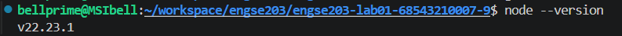
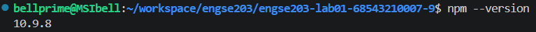
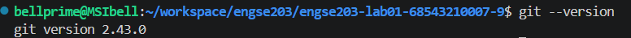
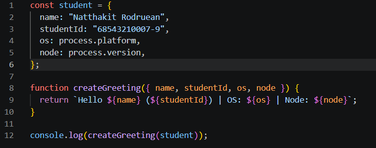
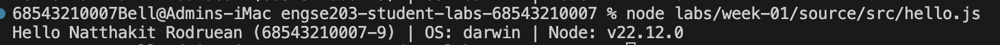

# Week 01 Evidence

---
## ผล `node --version`, `npm --version`, `git --version`

node --version

npm --version

git --version


---

## Screenshot โปรแกรม `hello.js`

ผลการรัน

---

## Original Repository URL และ Commit SHA
🔗 Driginal Repository URL : **[https://github.com/BELLprime/engse203-lab01-68543210007-9](https://github.com/BELLprime/engse203-lab01-68543210007-9)**
Commit SHA : b05da83fbe0c654a1b93ef4b31e6db2f3012f992

---
## Git Workflow
```bash
# 1.สร้าง branch ใหม่จาก main
git checkout -b feature/......

# 2.แก้ไข/เพิ่มโค้ด แล้ว commit
git add .
git commit -m "feat: add dashboard modules"

# 3.push branch ขึ้น GitHub
git push origin feature/......

# 4.เปิด Pull Request บน GitHub จาก feature/...... -> main
#    รอ review/ตรวจสอบ แล้วกด Merge

# 5.กลับมาที่ main และ pull โค้ดล่าสุด
git checkout main
git pull origin main
```
---
