# Week 04 Evidence

## Test Evidence

| ID | Scenario | Expected Result | Evidence |
|---|---|---|---|
| TC-01 | Initial render | initial requests/summary ถูกต้อง; console ไม่มี error | 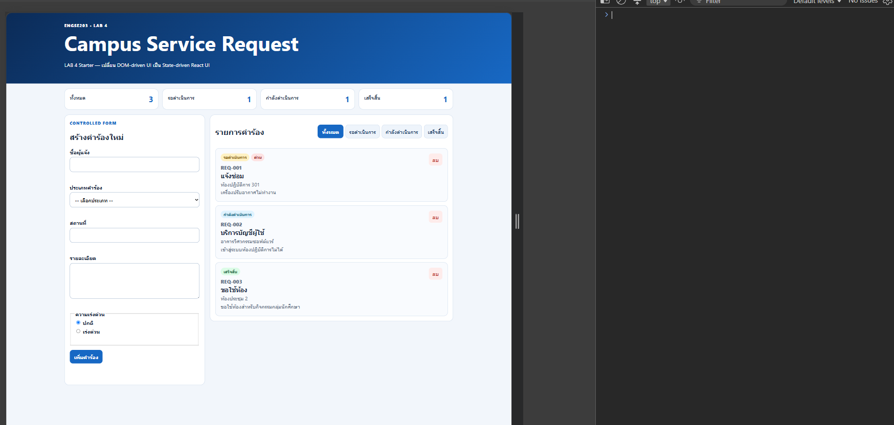 |
| TC-02 | Controlled input | ทุก field เปลี่ยนตาม state | 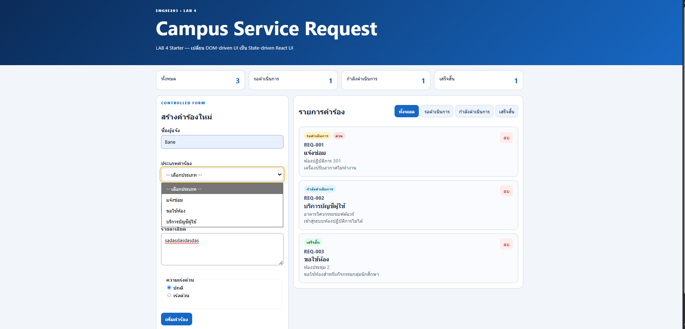 |
| TC-03 | Invalid submit | ไม่เพิ่ม; error ใกล้ field | 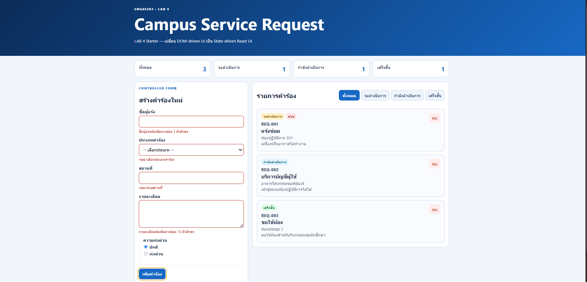 |
| TC-04 | Valid submit | เพิ่ม pending; summary เพิ่ม; reset form | 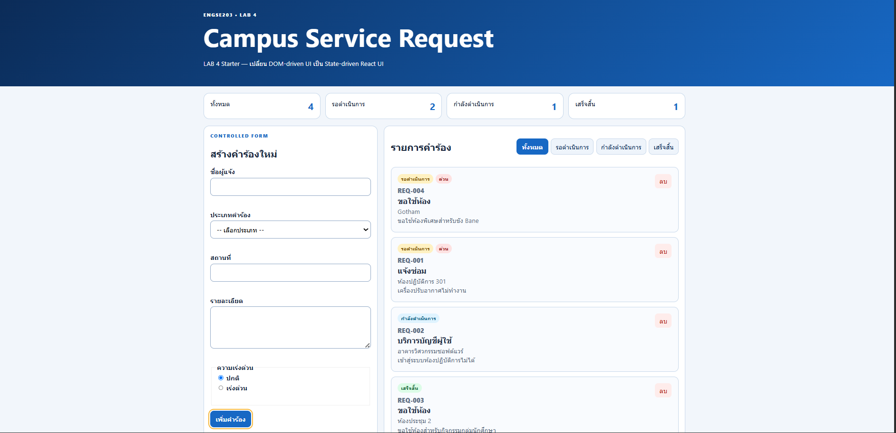 |
| TC-05 | Filter status | เห็นเฉพาะสถานะที่เลือก | 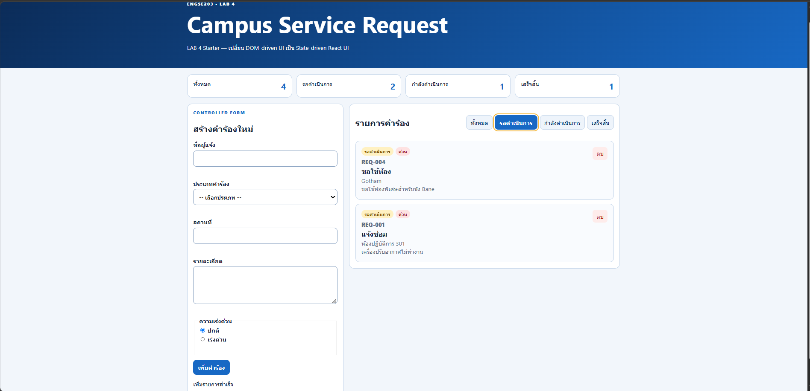 |
| TC-06 | Return all | เห็นทุกสถานะ | 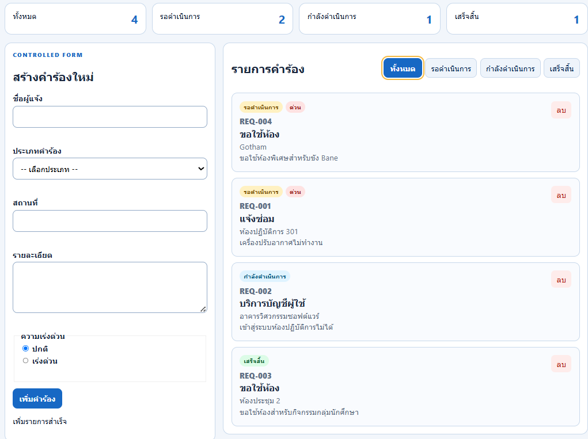 |
| TC-07 | Empty state | มีข้อความเมื่อไม่มีรายการ | 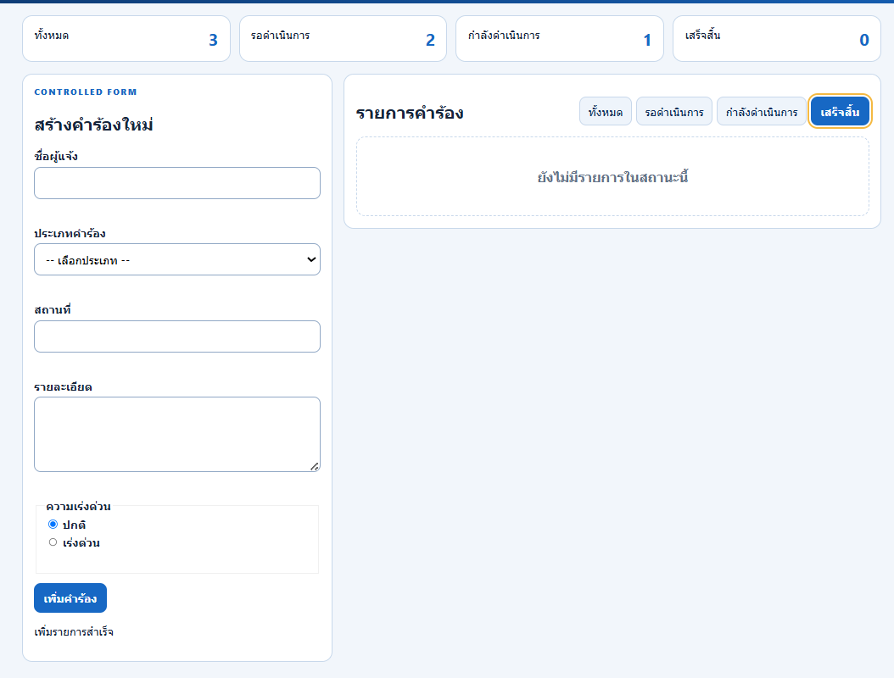 |
| TC-08 | Delete | ลบถูก id; summary/list เปลี่ยน | 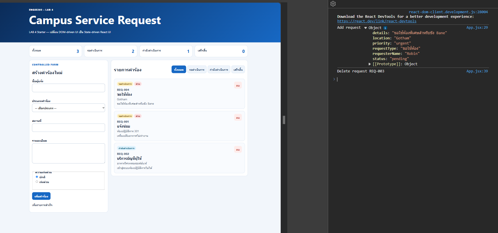 |
| TC-09 | 375px | ไม่มี horizontal scroll | 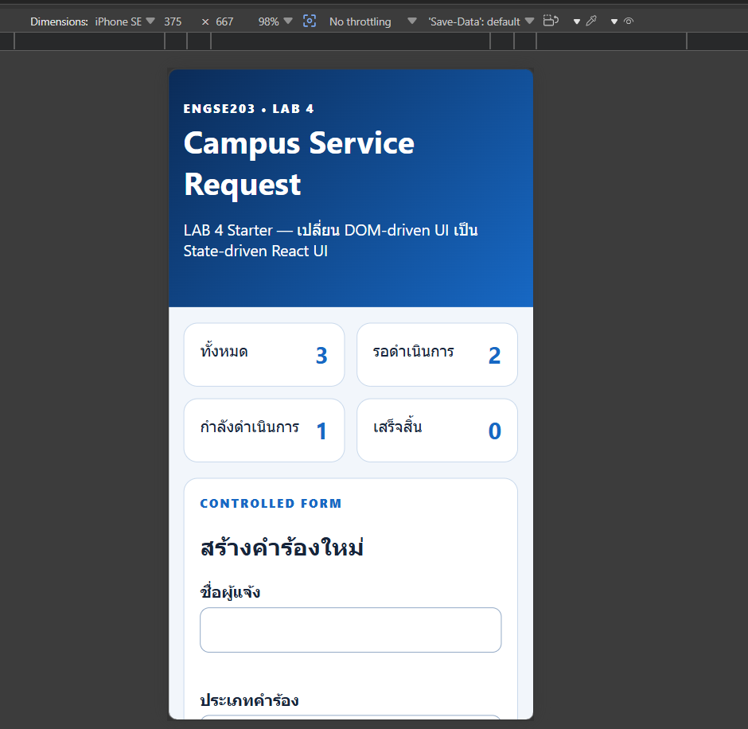 |
| TC-10 | Keyboard | focus/label/error/feedback ใช้งานได้ | 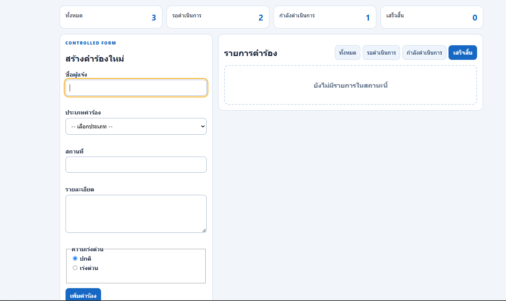 |
| TC-11 | Build/preview | `npm run build` และ preview ผ่าน | 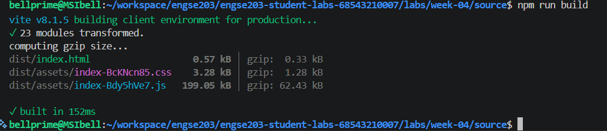 |
| TC-12 | Pages | Incognito โหลดหน้า/assets ครบ | 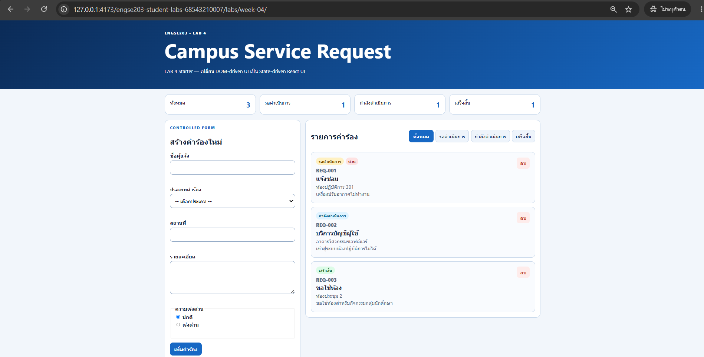 |

---

## Screenshots

### Desktop View
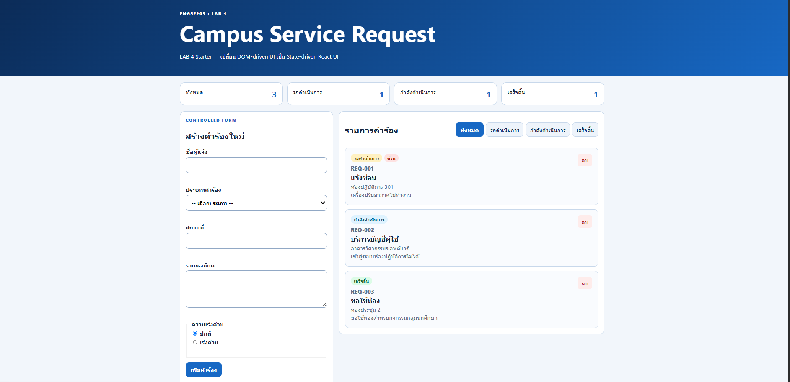

### Mobile View (375px)
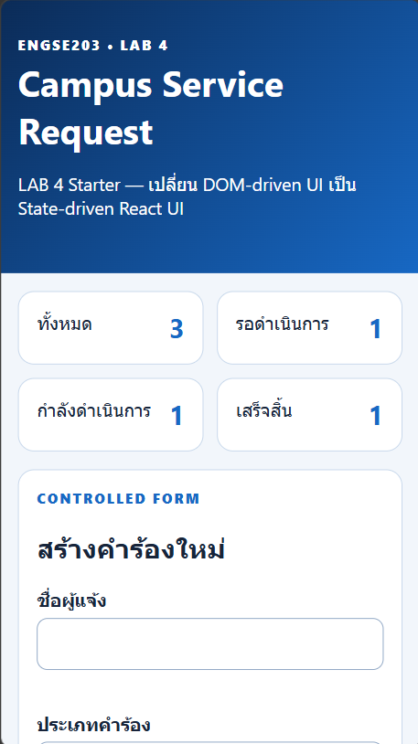

### Validation Error State

### Success State (เพิ่มคำร้องสำเร็จ)

### Empty State

---
## Week 03 → Week 04 Reflection

ใน Week 03 การอัปเดต UI ทำแบบ DOM-driven คือ อ่านค่าจากฟอร์มด้วย `FormData`/`querySelector`, แก้ไข array ข้อมูลเอง แล้วต้องเรียกฟังก์ชัน `renderRequests()` และ `updateSummary()` ด้วยตัวเองทุกครั้งที่ข้อมูลเปลี่ยน ทำให้ต้องคอยจำว่าจุดไหนของโค้ดต้อง sync หน้าจอใหม่บ้าง หากลืมเรียกฟังก์ชัน render จุดใดจุดหนึ่งจะทำให้ UI ไม่ตรงกับข้อมูลจริงได้ง่าย

ใน Week 04 เปลี่ยนมาเป็น State-driven UI ด้วย React คือเก็บ `requests` และ `statusFilter` เป็น state ที่ `App` และเปลี่ยนค่าผ่าน `setRequests`/`setStatusFilter` แบบ immutable (ไม่ mutate array เดิม) เท่านั้น ส่วนการ re-render, การคำนวณ `summary` และ `filteredRequests` ใหม่ React จัดการให้อัตโนมัติทุกครั้งที่ state เปลี่ยน ไม่ต้องเรียกฟังก์ชัน update UI เอง

ข้อดีที่เห็นชัดคือโค้ดสั้นลง คาดเดาพฤติกรรมได้ง่ายขึ้น (state เปลี่ยน → UI เปลี่ยนตามเสมอ) และบั๊กที่เจอบ่อยใน Week 04 ก็ต่างไปจาก Week 03 เดิม กลายเป็นเรื่องเฉพาะของ React เช่น การผสม `value`/`defaultValue` บน input ตัวเดียวกันจน React แจ้ง controlled/uncontrolled conflict, การ spread object ผิดลำดับจนค่าถูกเขียนทับโดยไม่ตั้งใจ (เช่น `id` ถูกทับด้วยค่าว่าง), และการใช้ `key` ซ้ำใน list ที่ React เตือนทันทีเพราะเป็นกลไกสำคัญของการ reconcile DOM — ปัญหาเหล่านี้ไม่มีทางเกิดใน Week 03 เพราะไม่มี concept ของ state/key/controlled component เลย
---
## PR URL และ Pages URL
- PR URL : [https://github.com/BELLprime/engse203-student-labs-68543210007/pull/5](https://github.com/BELLprime/engse203-student-labs-68543210007/pull/5)
- Pages URL : [https://bellprime.github.io/engse203-student-labs-68543210007/labs/week-04/](https://bellprime.github.io/engse203-student-labs-68543210007/labs/week-04/)
---