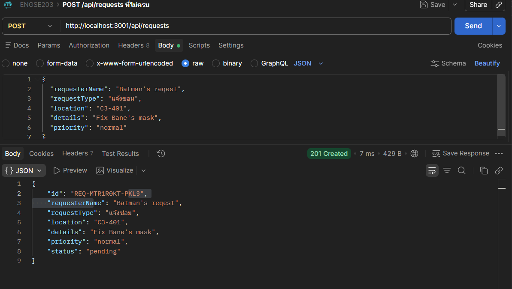
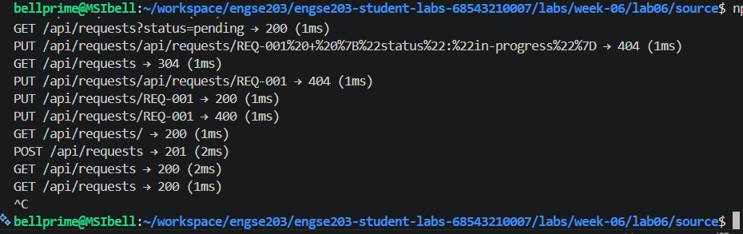
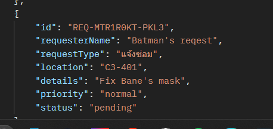
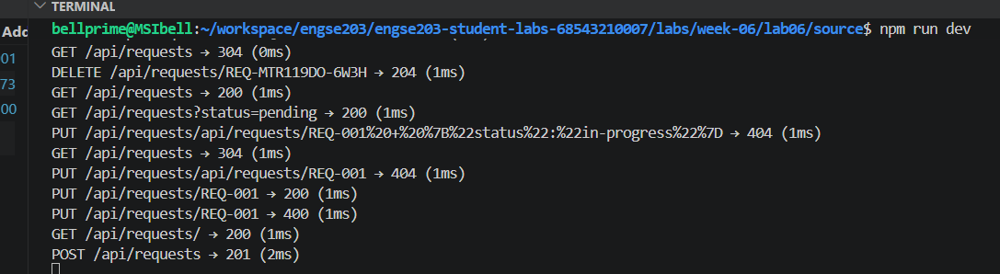

# ENGSE203 LAB 06 — Student Evidence README

## ผู้จัดทำ

- ชื่อ–นามสกุล: นายณัฏฐกิตติ์ รอดเรือน
- รหัสนักศึกษา: 68543210007-9
- Section: Sec 1
- ระบบปฏิบัติการที่ใช้: Windows 11 / WSL2 (Ubuntu 24.04 LTS)
- Node version: v22.23.1
- Branch: `unit3/week-06`
- Commit: `2602614`
- วันที่ทดสอบ: 7 กันยายน 2026

## URLs

- Repository: [https://github.com/BELLprime/engse203-student-labs-68543210007](https://github.com/BELLprime/engse203-student-labs-68543210007)
- Pull Request: [https://github.com/BELLprime/engse203-student-labs-68543210007/pull/7](https://github.com/BELLprime/engse203-student-labs-68543210007/pull/7)

---

## สถาปัตยกรรมระบบ & การแยกชั้นความรับผิดชอบ (System Architecture & Clean Layers)

```text
HTTP Client (Postman / Browser)
        │
        ▼
[Express App: src/app.js]
        │
        ├── 1. Logger Middleware (src/middleware/logger.js)
        ├── 2. Body Parser (express.json())
        │
        ├── 3. Root Endpoint: GET /
        │
        ├── 4. Request Router (src/routes/requestRoutes.js) ── Mount at: /api/requests
        │       ├── GET    /            ──> controller.listRequests      ──> service.findAll
        │       ├── GET    /?status=    ──> controller.listRequests      ──> service.findAll(status) [⭐ Challenge]
        │       ├── GET    /:id         ──> controller.getRequest        ──> service.findById
        │       ├── POST   /            ──> [validateRequest] ──> controller.createRequest ──> service.create
        │       ├── PUT    /:id         ──> controller.updateRequestStatus ──> service.updateStatus [⭐ Challenge]
        │       └── DELETE /:id         ──> controller.deleteRequest     ──> service.remove
        │
        ├── 5. Fallback 404 Not Found (src/middleware/errorHandler.js -> notFound)
        └── 6. Centralized Error Handler (src/middleware/errorHandler.js -> errorHandler)
                │
                ▼
[Service & Persistence Layer: src/services/requestService.js]
        ├── In-memory Array: requests[]
        └── File Persistence: data/requests.json (Fallback: data/initialRequests.json)
```

### รายละเอียดการแบ่งชั้นตามหลัก Clean Architecture (CP06)

| ชั้น (Layer) | ไฟล์ที่เกี่ยวข้อง | หน้าที่และความรับผิดชอบ (Responsibilities) | ข้อจำกัดและสิ่งที่ห้ามทำ (Constraints) |
|---|---|---|---|
| **Routing Layer** | `src/routes/requestRoutes.js` | กำหนดคู่ระหว่าง HTTP Method + Path กับ Handler ใน Controller และแทรก Middleware เฉพาะเส้นทาง | **ห้ามมี Business Logic** หรือคำนวณข้อมูลโดยเด็ดขาด |
| **Middleware Layer** | `src/middleware/logger.js`<br>`src/middleware/validateRequest.js`<br>`src/middleware/errorHandler.js` | ดักจับและประมวลผล Request ก่อนถึง Handler เช่น จับเวลาและบันทึก Log, ตรวจสอบความถูกต้องของ Input Body (Validation), ดักจับ 404 Route Not Found, และรวมศูนย์จัดการ Error 500 ปลอดภัย | ห้ามส่ง response ซ้ำเมื่อเรียก `next()` และ Error Handler ต้องมีครบ 4 พารามิเตอร์ `(err, req, res, next)` เสมอ |
| **Controller Layer** | `src/controllers/requestController.js` | อ่านค่าจาก Request (`req.params`, `req.query`, `req.body`), ตัดสินใจกำหนด HTTP Status Code (200, 201, 204, 400, 404), ส่ง Response กลับในรูปแบบ JSON | **ห้ามเข้าถึงหรือแก้ไขตัวแปร Array ข้อมูลโดยตรง** ต้องเรียกผ่าน Service Layer เท่านั้น |
| **Service Layer** | `src/services/requestService.js` | จัดการ Data Logic (ค้นหา, เพิ่ม, อัปเดต, ลบ), สร้าง ID อัตโนมัติ, Clone ข้อมูลด้วย `structuredClone()` ป้องกัน Mutation และสั่งบันทึกข้อมูลลงไฟล์ (`persist`) | **ห้ามรู้จัก HTTP (`req`/`res`) โดยเด็ดขาด** คืนเฉพาะ Data, Object, Array, boolean หรือ null |
| **Persistence Layer** | `data/requests.json` | จัดเก็บข้อมูลลง File System อย่างถาวร ข้อมูลไม่สูญหายเมื่อรีสตาร์ทเซิร์ฟเวอร์ | ต้องระบุใน `.gitignore` เพื่อไม่ให้ commit ไฟล์ runtime |

---

## API Contract สรุป

> ดูรายละเอียดฉบับเต็มพร้อม Schema และตัวอย่าง Payload ได้ที่ [api-contract-template.md](api-contract-template.md) หรือ [evidence/api-contract-template.md](evidence/api-contract-template.md)

| Endpoint | Method | คำอธิบาย | Status สำเร็จ | Status ผิดพลาด |
|---|---|---|---|---|
| `/` | `GET` | ตรวจสอบสถานะเซิร์ฟเวอร์ (Health Check) | `200 OK` | — |
| `/api/requests` | `GET` | ดึงรายการคำร้องทั้งหมด | `200 OK` | `500 Internal Server Error` |
| `/api/requests?status=:status` | `GET` | ⭐ กรองคำร้องตามสถานะ (`pending`, `in-progress`, `completed`) | `200 OK` | `500 Internal Server Error` |
| `/api/requests/:id` | `GET` | ดึงรายละเอียดคำร้องตาม ID | `200 OK` | `404 Not Found` |
| `/api/requests` | `POST` | สร้างคำร้องใหม่ (ผ่าน validation) | `201 Created` | `400 Bad Request` (พร้อม array details) |
| `/api/requests/:id` | `PUT` | ⭐ ปรับปรุงสถานะคำร้อง | `200 OK` | `400 Bad Request` (สถานะผิด) / `404 Not Found` |
| `/api/requests/:id` | `DELETE` | ลบคำร้องตาม ID | `204 No Content` | `404 Not Found` |
| `/*` (เส้นทางที่ไม่มี) | `ANY` | ดักจับ URL ที่ไม่มีในระบบ | — | `404 Not Found` (JSON format) |

---

## Setup และ Run

```bash
# 1. ติดตั้ง Dependencies
npm install

# 2. รันโหมด Development (Watch mode)
npm run dev

# 3. รันตัวตรวจเช็คมาตรฐาน (Automated Checker)
npm run check             # ตรวจสอบครบทุก Checkpoint (28/28 รายการ)
npm run check -- --inclass # ตรวจสอบเฉพาะส่วน In-Class (23/23 รายการ)
```

---

## รายงานผลการทดสอบ (TEST REPORT)

**เงื่อนไขเริ่มต้นของการทดสอบ:** เซิร์ฟเวอร์รันอยู่ที่พอร์ต `3001` (`http://localhost:3001`) และทดสอบยิง Request ผ่าน Postman / Automated Checker

### 🏫 In-Class & Take-Home (CP01–CP07)

| ID | Method | Path / Action | สิ่งที่ส่ง (Payload) | ผลที่ควรได้ | ผลจริง | สถานะ | หลักฐานอ้างอิง |
|---|---|---|---|---|---|---|---|
| **TC-L6-01** | `GET` | `/` | — | `200 OK` + ข้อความสถานะ API | ได้ `200 OK` พร้อม JSON message และ version | PASS | Checker CP01 |
| **TC-L6-02** | `GET` | `/api/requests` | — | `200 OK` + Array คำร้องทั้งหมด | ได้ `200 OK` ข้อมูลคำร้องครบถ้วน | PASS | `evidence/images/postman-get-200.png` |
| **TC-L6-03** | `GET` | `/api/requests/REQ-001` | — | `200 OK` + ข้อมูลของ REQ-001 | ได้ `200 OK` ข้อมูลตรงตาม ID | PASS | Checker CP02 |
| **TC-L6-04** | `GET` | `/api/requests/REQ-999` | — | `404 Not Found` + JSON Error | ได้ `404 Not Found` แจ้งไม่พบคำร้อง | PASS | Checker CP02 |
| **TC-L6-05** | `POST` | `/api/requests` | Body ครบถ้วนตาม Schema | `201 Created` + ข้อมูลคำร้องที่สร้างใหม่ (`id: REQ-...`, `status: pending`) | ได้ `201 Created` รหัสขึ้นต้นด้วย REQ- สถานะเริ่มต้น pending | PASS | `evidence/images/postman-post-201.png` |
| **TC-L6-06** | `POST` | `/api/requests` | ข้อมูลไม่ครบ/ผิดเงื่อนไข เช่น `requesterName: "x"`, `details` สั้น | `400 Bad Request` + JSON details บอกรายการข้อผิดพลาด | ได้ `400 Bad Request` พร้อม array details ชัดเจน | PASS | Checker CP04 & CP07 |
| **TC-L6-07** | `DELETE` | `/api/requests/REQ-003` | — | `204 No Content` ข้อมูลถูกลบออกจากระบบ | ได้ `204 No Content` และยิง GET ซ้ำไม่พบข้อมูลเดิมแล้ว | PASS | Checker CP05 |
| **TC-L6-08** | `DELETE` | `/api/requests/REQ-999` | — | `404 Not Found` + JSON Error | ได้ `404 Not Found` เนื่องจากไม่มี ID ดังกล่าว | PASS | Checker CP05 |
| **TC-L6-09** | `GET` | `/api/unknown-path` | — | `404 Not Found` รูปแบบ JSON (ไม่ใช่หน้า HTML ของ Express) | ได้ `404 Not Found` พร้อม JSON error รวมศูนย์ | PASS | Checker CP07 |

### ⭐ Challenge (คะแนนพิเศษ +15%)

| ID | Method | Path / Action | สิ่งที่ส่ง (Payload) | ผลที่ควรได้ | ผลจริง | สถานะ | หลักฐานอ้างอิง |
|---|---|---|---|---|---|---|---|
| **TC-L6-10** | `GET` | `/api/requests?status=pending` | Query parameter `status=pending` | `200 OK` กรองเฉพาะรายการที่เป็น pending | ได้ `200 OK` ทุกรายการมี status เป็น pending ทั้งหมด | PASS | `evidence/images/zGETfilter.png` |
| **TC-L6-11** | `PUT` | `/api/requests/REQ-001` | Body: `{"status": "in-progress"}` | `200 OK` สถานะถูกเปลี่ยนเป็น in-progress | ได้ `200 OK` ค่า status ของ REQ-001 เปลี่ยนเป็น in-progress | PASS | `evidence/images/PUTreq1_to_inprogess.png` |
| **TC-L6-12** | `PUT` | `/api/requests/REQ-001` | Body: `{"status": "มั่ว"}` | `400 Bad Request` ปฏิเสธสถานะที่ไม่ถูกต้อง | ได้ `400 Bad Request` แจ้งสถานะไม่ถูกต้อง | PASS | `evidence/images/PUTstatus_unknown.png` |

### 🏠 การทดสอบความคงอยู่ของข้อมูล (CP08 Data Persistence)

| ขั้นตอน | การกระทำ | ผลลัพธ์ที่สังเกตได้ | สถานะ | ภาพหลักฐาน |
|---|---|---|---|---|
| **1. Create** | ยิง `POST /api/requests` เพื่อเพิ่มคำร้องใหม่ | เซิร์ฟเวอร์ตอบ `201 Created` และบันทึกลง `data/requests.json` | PASS |  |
| **2. Verify In-Memory** | ยิง `GET /api/requests` ตรวจสอบรายการ | พบคำร้องใหม่ที่เพิ่งเพิ่มปรากฏในรายการ | PASS |  |
| **3. Server Restart** | กด `Ctrl + C` ปิดเซิร์ฟเวอร์ใน Terminal แล้วเปิดใหม่ (`npm run dev`) | เซิร์ฟเวอร์ปิดตัวและเริ่มทำงานใหม่โดยโหลดข้อมูลจาก `data/requests.json` | PASS |  |
| **4. Verify Persistence** | ยิง `GET /api/requests` ตรวจสอบซ้ำหลังเปิดเครื่องใหม่ | **คำร้องใหม่ยังคงอยู่ ไม่สูญหาย** | PASS |  |

### 📊 Terminal Logger Middleware Evidence (CP03)

ภาพแสดงการทำงานของ `logger` middleware ที่สามารถจับ Method, Path, Status Code และเวลาในการตอบสนอง (Response Time ms) ได้อย่างแม่นยำทุกคำขอ:



---

### สรุปผลการทดสอบทั้งหมด (Test Summary)

| รายการทดสอบ | จำนวนที่ผ่าน | จำนวนทั้งหมด | คิดเป็นเปอร์เซ็นต์ |
|---|---|---|---|
| 🏫 ในห้อง (In-Class CP00–CP05) | 23 | 23 | 100% |
| 🏠 ที่บ้าน (Take-Home CP06–CP08) | 2 | 2 | 100% |
| ⭐ Challenge (คะแนนพิเศษ) | 3 | 3 | 100% |
| **รวมการทดสอบจาก Automated Checker** | **28** | **28** | **100%** |
| การทดสอบความคงอยู่ของข้อมูล (Persistence Flow) | 4 | 4 | 100% |
| **สถานะรวมทุกการทดสอบ** | **PASS ทั้งหมด** | — | **สมบูรณ์ 100%** |

---

## Week 05 → Week 06 Reflection (การสะท้อนการเรียนรู้)

ใน **Week 05** เราโฟกัสการพัฒนาทางฝั่ง **Front-end (Client-Side)** ด้วย React โดยใช้ `react-router-dom` (HashRouter) เพื่อจัดการ Single Page Application (SPA), ควบคุม UI State ด้วย Hook, และจัดเก็บข้อมูลชั่วคราวผ่าน Web Browser ด้วย `localStorage` ข้อจำกัดสำคัญคือ ข้อมูลผูกติดอยู่กับเบราว์เซอร์ของเครื่องผู้ใช้แต่ละคน ไม่สามารถแชร์หรือประมวลผลข้อมูลร่วมกันได้จริง

ใน **Week 06** เราได้ขยับมาสร้างระบบส่วนหลัง **Back-end (Server-Side)** เต็มรูปแบบด้วย **Node.js และ Express**:

1. **RESTful Architecture & Separation of Concerns:**
   - ได้เรียนรู้การออกแบบ REST API ที่เป็นไปตามมาตรฐานการใช้ HTTP Verbs (`GET`, `POST`, `PUT`, `DELETE`) และการเลือกใช้ HTTP Status Codes อย่างถูกต้องและสื่อความหมาย (`200`, `201`, `204`, `400`, `404`, `500`)
   - การแยกความรับผิดชอบเป็น 3 ชั้น (`Route` ➔ `Controller` ➔ `Service`) ตามหลัก Clean Architecture ทำให้โค้ดมีระเบียบอย่างยิ่ง: Controller ดูแลเฉพาะเรื่อง HTTP Protocol ส่วน Service ดูแลเฉพาะ Data Logic โดยไม่ยึดติดกับ HTTP ทำให้ในอนาคต (Week ถัดไป) หากต้องเปลี่ยนการเก็บข้อมูลเป็นฐานข้อมูล SQLite จะแก้ไขเฉพาะ Service Layer ไฟล์เดียวโดยไม่กระทบ Controller หรือ Route เลย
2. **Middleware Pipeline:**
   - เข้าใจกลไก Request-Response Cycle ของ Express ที่ทำงานเป็นลำดับ (Pipeline)
   - การสร้าง Logger บันทึกการทำงาน, Body Parser (`express.json()`) เพื่อแกะ JSON Payload, Validation Middleware เพื่อตรวจข้อมูลก่อนเข้าถึง Business Logic
   - รวมไปถึง Centralized Error Handling ที่ใช้ฟังก์ชัน 4 พารามิเตอร์ `(err, req, res, next)` ดักจับ Error ที่ไม่คาดคิดและตอบ 500 JSON ปลอดภัยโดยไม่เปิดเผย Stack Trace แก่ผู้ใช้ภายนอก
3. **Data Persistence:**
   - เปลี่ยนจากการพึ่งพา `useState` / `localStorage` บนเบราว์เซอร์ มาเป็นการบันทึกข้อมูลลง File System ของเซิร์ฟเวอร์ด้วย `node:fs/promises` (`requests.json`) ทำให้ข้อมูลของระบบอยู่รอดแม้จะมีการรีสตาร์ทเซิร์ฟเวอร์
   - การวางรากฐาน API ใน Week 06 นี้ถูกออกแบบมาให้ตรงกับ Method ใน `requestService.js` ของ Front-end Week 05 อย่างสมบูรณ์ เพื่อเตรียมพร้อมสำหรับการเชื่อมต่อข้ามระบบ (Full-Stack) ผ่าน CORS ใน Week 07

---

## AI / Resource Usage

| เครื่องมือ / แหล่งอ้างอิง | วัตถุประสงค์ในการใช้งาน | ส่วนที่นำมาใช้งาน | วิธีการตรวจสอบความถูกต้อง | การตัดสินใจขั้นสุดท้าย |
|---|---|---|---|---|
| **Gemini / AI Assistant** | ตรวจสอบ Clean Architecture (CP06) และ Error Handling (CP07) | ทำความเข้าใจหลักการ 3-Tier Layering และการทำงานของ Express Error Middleware 4 parameters `(err, req, res, next)` | ค้นหาคำว่า `req`, `res` ใน `requestService.js` ต้องไม่พบ และทดสอบยิงเส้นทางที่ไม่มีอยู่จริงเพื่อดู JSON 404/500 | แยกโค้ดขาดจากกัน 100% ตามข้อกำหนด และไม่ส่ง stack trace ออกไปใน response |
| **Gemini / AI Assistant** | ให้คำปรึกษาเรื่อง File Persistence (CP08) และ Challenge Logic | แนวทางการใช้ `node:fs/promises` (`writeFile`, `readFile`) และการจัดโครงสร้าง `updateStatus` | ทดสอบเพิ่มคำร้องผ่าน Postman ปิดเซิร์ฟเวอร์ด้วย Ctrl+C แล้วเปิดใหม่เพื่อตรวจว่าข้อมูลยังอยู่ และรัน `npm run check` | เพิ่มฟังก์ชัน `persist()` ใน `create`, `remove` รวมถึง `updateStatus` พร้อมระบุ `data/requests.json` ใน `.gitignore` |
| **Official Express Docs** | ศึกษาการเขียน Custom Middleware และ Router | โครงสร้าง `Router()`, `res.on('finish')` ใน Logger และ Validation Pipeline | รันเซิร์ฟเวอร์และดูการแสดงผล Log เวลาใน Terminal จริง | นำมาปรับใช้สร้าง Logger Middleware ที่วัด Response Time เป็นมิลลิวินาที |