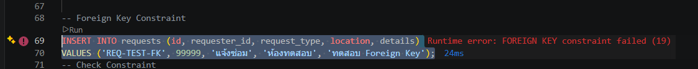
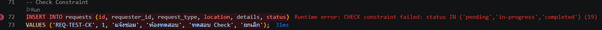
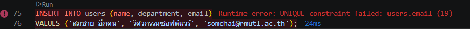
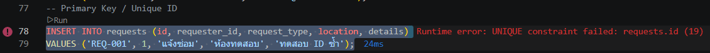
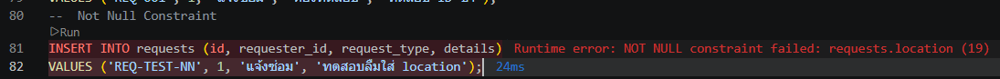
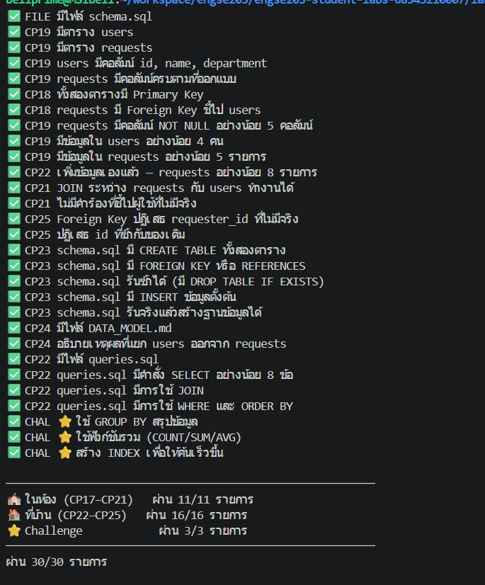

# ENGSE203 LAB 09 — Evidence Report

**วิชา:** ENGSE203 การพัฒนาซอฟต์แวร์ประยุกต์สำหรับองค์กร  
**สัปดาห์ที่ 9:** ฐานข้อมูลเชิงสัมพันธ์และภาษา SQL (SQLite)  
**ผู้จัดทำ:** นายณัฏฐกิตติ์ รอดเรือน (รหัสนักศึกษา: 68543210007-9, Sec 1)  

---

## 3. การทดสอบข้อกำหนดความถูกต้องของข้อมูล (Constraints Verification — CP25)

เพื่อพิสูจน์ว่าฐานข้อมูล `campus.db` บังคับใช้กฎเกณฑ์ความถูกต้องอย่างเคร่งครัด ได้ทำการทดสอบรันคำสั่ง SQL ที่ตั้งใจส่งข้อมูลผิดพลาด 5 รูปแบบ และบันทึกผลการปฏิเสธของ SQLite:

| ลำดับ | ประเภท Constraint | คำสั่ง SQL ที่ทดสอบ | ผลลัพธ์ / Error ที่ระบบตอบกลับ | ผลการประเมิน |
|---|---|---|---|---|
| **①** | **Foreign Key** | `INSERT INTO requests (id, requester_id, request_type, location, details) VALUES ('REQ-TEST-FK', 99999, 'แจ้งซ่อม', 'ห้องทดสอบ', 'ทดสอบ FK');` | `FOREIGN KEY constraint failed` | ✅ ปลอดภัย (ปฏิเสธ requester_id ที่ไม่มีในตาราง users) |
| **②** | **Check** | `INSERT INTO requests (id, requester_id, request_type, location, details, status) VALUES ('REQ-TEST-CK', 1, 'แจ้งซ่อม', 'ห้องทดสอบ', 'ทดสอบ Check', 'ยกเลิก');` | `CHECK constraint failed` | ✅ ปลอดภัย (ปฏิเสธสถานะที่ไม่อยู่ใน allowlist) |
| **③** | **Unique** | `INSERT INTO users (name, department, email) VALUES ('สมชาย อีกคน', 'วิศวกรรมซอฟต์แวร์', 'somchai@rmutl.ac.th');` | `UNIQUE constraint failed: users.email` | ✅ ปลอดภัย (ปฏิเสธอีเมลที่ซ้ำกับข้อมูลเดิม) |
| **④** | **Primary Key** | `INSERT INTO requests (id, requester_id, request_type, location, details) VALUES ('REQ-001', 1, 'แจ้งซ่อม', 'ห้องทดสอบ', 'ทดสอบ ID ซ้ำ');` | `UNIQUE constraint failed: requests.id` | ✅ ปลอดภัย (ปฏิเสธรหัสคำร้องที่ซ้ำกัน) |
| **⑤** | **Not Null** | `INSERT INTO requests (id, requester_id, request_type, details) VALUES ('REQ-TEST-NN', 1, 'แจ้งซ่อม', 'ทดสอบลืมใส่ location');` | `NOT NULL constraint failed: requests.location` | ✅ ปลอดภัย (ปฏิเสธแถวที่ขาดข้อมูลจำเป็น) |

### 📸 ภาพหลักฐานการทดสอบ Constraints (CP25)

#### ① Foreign Key Constraint Failed


#### ② Check Constraint Failed


#### ③ Unique Constraint Failed


#### ④ Primary Key / Unique ID Constraint Failed


#### ⑤ Not Null Constraint Failed


---

## 4. ผลการตรวจสอบอัตโนมัติ (Checker Verification — 30/30 รายการ)

ได้ทำการรันสคริปต์ `node check-week09.mjs` เพื่อตรวจสอบความถูกต้องของโครงสร้างฐานข้อมูล, ความสัมพันธ์ระหว่างตาราง, ข้อมูลตัวอย่าง, และคำสั่งค้นหาข้อมูลทั้งหมด:

```text
✅ FILE มีไฟล์ campus.db
✅ FILE มีไฟล์ schema.sql
✅ CP19 มีตาราง users
✅ CP19 มีตาราง requests
✅ CP19 users มีคอลัมน์ id, name, department
✅ CP19 requests มีคอลัมน์ครบตามที่ออกแบบ
✅ CP18 ทั้งสองตารางมี Primary Key
✅ CP18 requests มี Foreign Key ชี้ไป users
✅ CP19 requests มีคอลัมน์ NOT NULL อย่างน้อย 5 คอลัมน์
✅ CP19 มีข้อมูลใน users อย่างน้อย 4 คน
✅ CP19 มีข้อมูลใน requests อย่างน้อย 5 รายการ
✅ CP22 เพิ่มข้อมูลเองแล้ว — requests อย่างน้อย 8 รายการ
✅ CP21 JOIN ระหว่าง requests กับ users ทำงานได้
✅ CP21 ไม่มีคำร้องที่ชี้ไปผู้ใช้ที่ไม่มีจริง
✅ CP25 Foreign Key ปฏิเสธ requester_id ที่ไม่มีจริง
✅ CP25 ปฏิเสธ id ที่ซ้ำกับของเดิม
✅ CP23 schema.sql มี CREATE TABLE ทั้งสองตาราง
✅ CP23 schema.sql มี FOREIGN KEY หรือ REFERENCES
✅ CP23 schema.sql รันซ้ำได้ (มี DROP TABLE IF EXISTS)
✅ CP23 schema.sql มี INSERT ข้อมูลตั้งต้น
✅ CP23 schema.sql รันจริงแล้วสร้างฐานข้อมูลได้
✅ CP24 มีไฟล์ DATA_MODEL.md
✅ CP24 อธิบายเหตุผลที่แยก users ออกจาก requests
✅ CP22 มีไฟล์ queries.sql
✅ CP22 queries.sql มีคำสั่ง SELECT อย่างน้อย 8 ข้อ
✅ CP22 queries.sql มีการใช้ JOIN
✅ CP22 queries.sql มีการใช้ WHERE และ ORDER BY
✅ CHAL ⭐ ใช้ GROUP BY สรุปข้อมูล
✅ CHAL ⭐ ใช้ฟังก์ชันรวม (COUNT/SUM/AVG)
✅ CHAL ⭐ สร้าง INDEX เพื่อให้ค้นเร็วขึ้น

──────────────────────────────────────────────────────────
🏫 ในห้อง (CP17–CP21)   ผ่าน 11/11 รายการ (100%)
🏠 ที่บ้าน (CP22–CP25)   ผ่าน 16/16 รายการ (100%)
⭐ Challenge            ผ่าน 3/3 รายการ (100%)
──────────────────────────────────────────────────────────
ผ่าน 30/30 รายการ 🎉
```

### 📸 ภาพหลักฐานผลการตรวจ Checker

