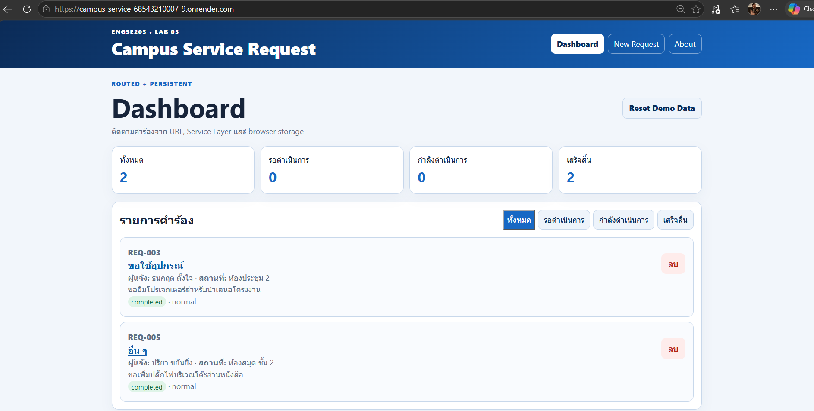

# หลักฐานการสาธิต (A4) — Campus Service

## ข้อมูลนักศึกษา
- **ชื่อ-นามสกุล:** ณัฏฐกิตติ์ รอดเรือน
- **รหัสนักศึกษา:** 68543210007
- **วิชา:** ENGSE203 Software Engineering Principles (SEC1)

---

## 🔗 ลิงก์วิดีโอนำเสนอ (ความยาวประมาณ 8–10 นาที)
- **ลิงก์วิดีโอ:** [https://youtu.be/3qqWghpkYfQ?si=V5M6oN4XcCKX2krX](https://youtu.be/3qqWghpkYfQ?si=V5M6oN4XcCKX2krX)

---

## สรุปเนื้อหาในวิดีโอ

### ช่วง A · สาธิตระบบทำงานครบวงจร (≈ 3–4 นาที)
- [x] **เปิดครบ 3 ชั้น:** React (frontend) + Express (API) + SQLite (`campus.db`)
- [x] **การทำงาน CRUD:** ดูรายการ, เพิ่มคำร้องใหม่, เปลี่ยนสถานะคำร้อง, ลบคำร้อง
- [x] **Health Check:** เรียก `GET /api/health` แสดงสถานะ `ok` และเชื่อมต่อ Database ได้
- [x] **ข้อมูลถาวร:** ปิดเซิร์ฟเวอร์แล้วเปิดใหม่ ข้อมูลยังอยู่ครบถ้วนใน SQLite
- [x] **Production Mode:** จำลองการรันพอร์ตเดียว (`NODE_ENV=production PORT=10000 npm start`) เปิดหน้าเว็บได้ที่พอร์ตเดียว

### ช่วง B · อธิบาย Source Code (≈ 4–5 นาที)
- [x] **Frontend คุยกับ API:** ชี้ไฟล์ `frontend/src/services/apiClient.js` และ `requestService.js` (การใช้ fetch และ relative path)
- [x] **Request เดินผ่านแต่ละชั้น:** แสดงการไหลจาก `requestRoutes.js` → `requestController.js` → `requestService.js`
- [x] **Service ทำงานกับ SQLite:** ชี้ไฟล์ `api/src/services/requestService.js` (การใช้ `node:sqlite`, prepare/all/get/run และ transaction)
- [x] **Config รวมศูนย์:** ชี้ไฟล์ `api/src/config.js` อธิบายการอ่านค่า `NODE_ENV`, `PORT`, `CORS_ORIGIN`, `DB_FILE`
- [x] **Health Check Endpoint:** ชี้ไฟล์ `api/src/routes/healthRoutes.js`
- [x] **Dev vs Production:** อธิบาย `api/src/app.js` (การเสิร์ฟ static files จาก `frontend/dist` เมื่อเป็น production)

---

## 🌐 Live Demo (Deploy บน Render)
- **URL:** [https://campus-service-68543210007-9.onrender.com](https://campus-service-68543210007-9.onrender.com)
- **Health Check:** [https://campus-service-68543210007-9.onrender.com/api/health](https://campus-service-68543210007-9.onrender.com/api/health)
- **ระบบฐานข้อมูล:** SQLite (`campus.db`)

## ภาพหน้าจอ

